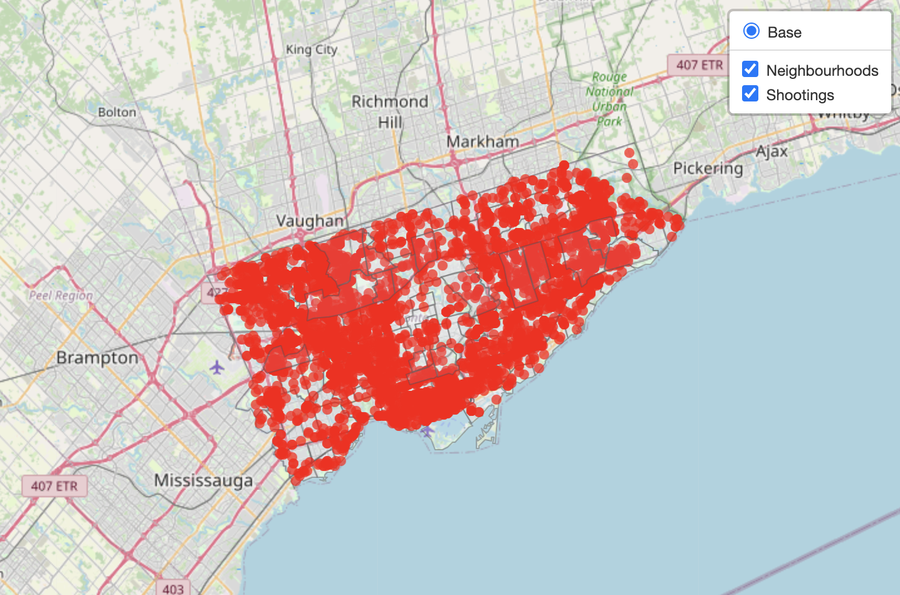
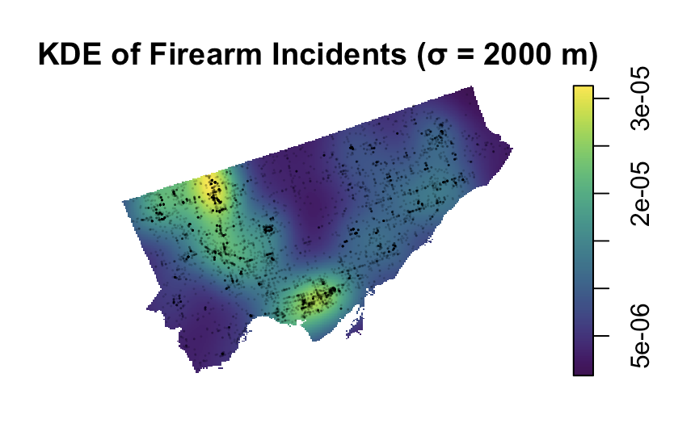
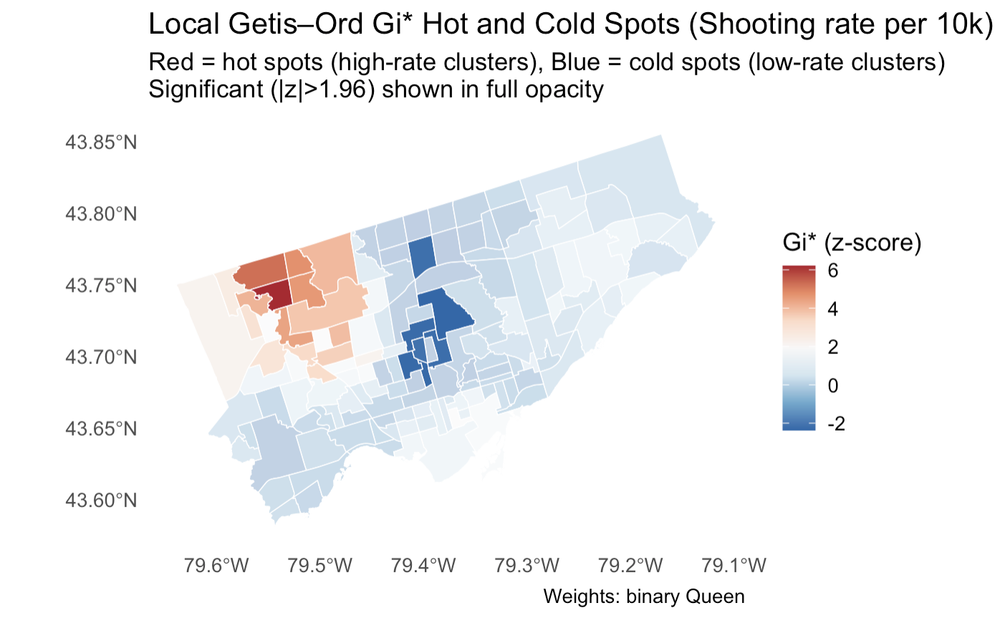

# Spatial-Patterns-and-Socioeconomic-Determinants-of-Firearm-Violence-Across-Toronto

## Project Overview

This project examines the spatial distribution of firearm-related incidents across Toronto and investigates how neighbourhood-level socioeconomic characteristics are associated with firearm violence. Using spatial statistical methods, the analysis identifies geographic clustering of shootings, detects statistically significant hotspots and coldspots, and evaluates socioeconomic predictors while accounting for spatial dependence.



The project was completed as part of **STA2016: Theory and Methods for Complex Spatial Data** at the **University of Toronto**.

---

## Research Questions

1. Are firearm violence incidents spatially clustered across Toronto, or consistent with complete spatial randomness?
2. How do firearm violence rates vary across Toronto neighbourhoods, and are there statistically significant hotspots and coldspots?
3. How are neighbourhood shooting rates associated with neighbourhood socioeconomic characteristics after accounting for spatial dependence?

---

## Data Sources

### Toronto Police Service – Shooting and Firearm Discharge Incidents
Contains geocoded firearm-related incidents occurring across Toronto.

### City of Toronto Neighbourhood Boundaries
Official neighbourhood boundary shapefiles used for spatial aggregation and mapping.

### Toronto Neighbourhood Profiles (2021 Census)
Neighbourhood-level demographic and socioeconomic indicators used to examine potential correlates of firearm violence.

---

## Methods

### Point Pattern Analysis
- Complete Spatial Randomness (CSR) testing
- Ripley's L-function
- Nearest-neighbour G-function
- Monte Carlo simulation envelopes

### Spatial Intensity Estimation
- Kernel Density Estimation (KDE)
- Multiple bandwidth comparisons

### Areal Analysis
- Neighbourhood shooting rates per 10,000 residents
- Queen contiguity weights
- Rook contiguity weights
- k-Nearest Neighbour spatial weights
- Global Moran's I
- Local Moran's I (LISA)
- Getis-Ord Gi* hotspot analysis

### Spatial Regression
- Ordinary Least Squares (OLS)
- Spatial Error Model (SEM)
- Spatial Lag Model (SAR)
- Spatial Lag-Error Model
- Conditional Autoregressive (CAR) Model

---

## Key Findings

- Firearm incidents exhibit significant spatial clustering and deviate strongly from complete spatial randomness.
- Neighbourhood shooting rates show substantial positive spatial autocorrelation.
- Distinct hotspots and coldspots of firearm violence exist across Toronto.
- Spatial regression models outperform ordinary least squares models by accounting for spatial dependence.
- The proportion of Black residents was consistently associated with higher neighbourhood shooting rates after controlling for other socioeconomic factors and spatial effects.

> **Important:** These results represent neighbourhood-level associations and should not be interpreted as causal relationships.



---

## Repository Structure

```text
├── analysis/      # R Markdown analysis and code
├── data/          # Raw datasets and shapefiles
├── figures/       # Maps, KDE plots, hotspot maps, regression diagnostics
├── report/        # Final report and LaTeX source
└── README.md
```
---

## Software and Packages

The analysis was conducted in **R** using packages including:

- sf
- spatstat
- spdep
- spatialreg
- tmap
- ggplot2
- dplyr
- tidyr
- stringr
- readr

---

## Reproducibility

1. Clone this repository.
2. Install the required R packages.
3. Place all datasets in the `data/` directory.
4. Open `STA2016_Final_Project.Rmd`.
5. Knit the R Markdown file to reproduce the analysis, figures, and results.

---

## Author

**Nevena Ciganovic**  
M.Sc. Statistical Sciences  
University of Toronto

---
